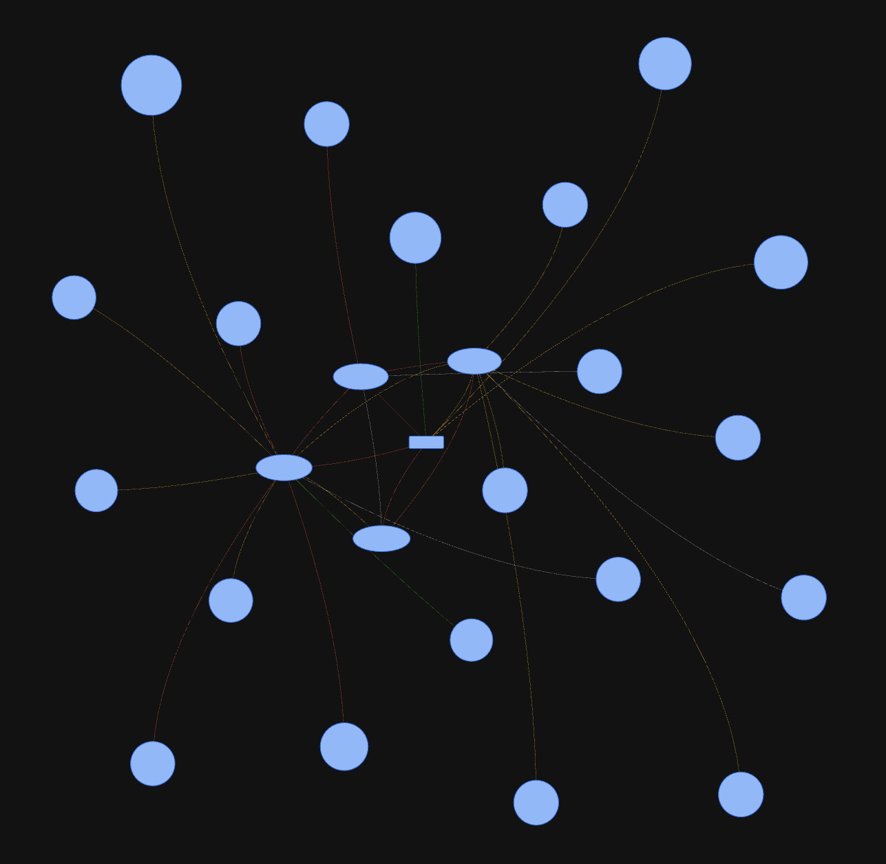
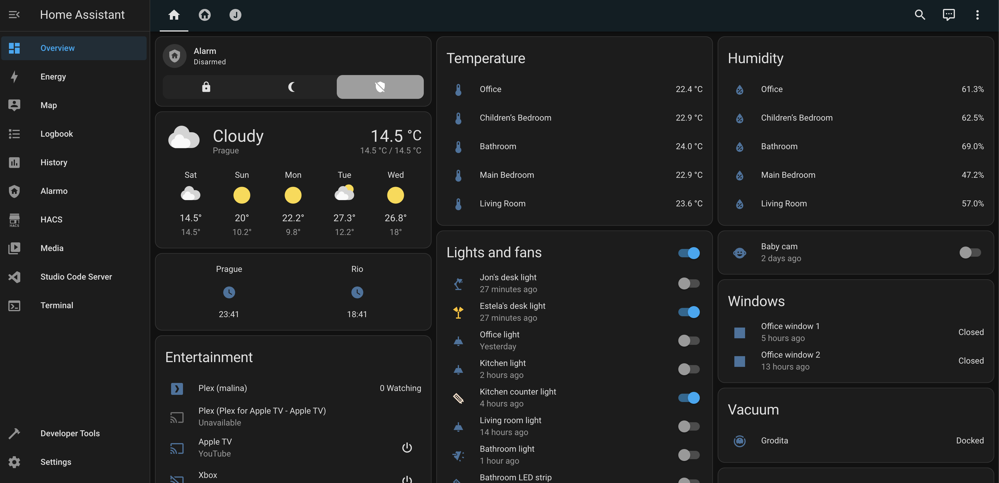

# Home Assistant Configuration

Here's my [Home Assistant](https://home-assistant.io/) configuration on [Home Assistant Yellow](https://www.home-assistant.io/yellow/).

You can check my current HA version [here](.HA_VERSION). If you like anything here, Be sure to :star2: my repo!

## Some of the devices and services that I use with HA

  * [Tesla Smart](https://www.teslasmart.com/smart-sensors) for Zigbee sensors
    * Currently using [temperature/humidity](https://www.teslasmart.com/tesla-smart-sensor-temperature-and-humidity), [door/window](https://www.teslasmart.com/tesla-smart-sensor-windows-and-door), [smoke](https://www.teslasmart.com/tesla-smart-sensor-smoke) and [motion](https://www.teslasmart.com/tesla-smart-sensor-motion) sensors
  * Security
    * [Tesla Smart sensor Siren](https://www.teslasmart.com/tesla-smart-sensor-siren)
  * Networking
    * [Pi-Hole](https://pi-hole.net/) with [Sensor](https://home-assistant.io/components/sensor.pi_hole/)
  * Lights and Switches
    * [Tesla Smart switches](https://www.teslasmart.com/tesla-smart-switch-zigbee)
  * Media
    * [Plex](https://www.plex.tv/) for media consumption along with [Plex component](https://home-assistant.io/components/media_player.plex/)
  * Notifications:
    * [iOS ](https://home-assistant.io/docs/ecosystem/ios/notifications/basic/) for basic notifications

## My Home Assistant dashboard

Here are some screenshots (please note that these may not be the most updated images, but you should get an idea).

# Useful links

* [HA cheat sheet](https://github.com/arsaboo/homeassistant-config/blob/master/HASS%20Cheatsheet.md) for miscellaneous tips and tricks.
* The idea for this repo was taken from [arsaboo/homeassistant-config](https://github.com/arsaboo/homeassistant-config/blob/master/HASS%20Cheatsheet.md)
