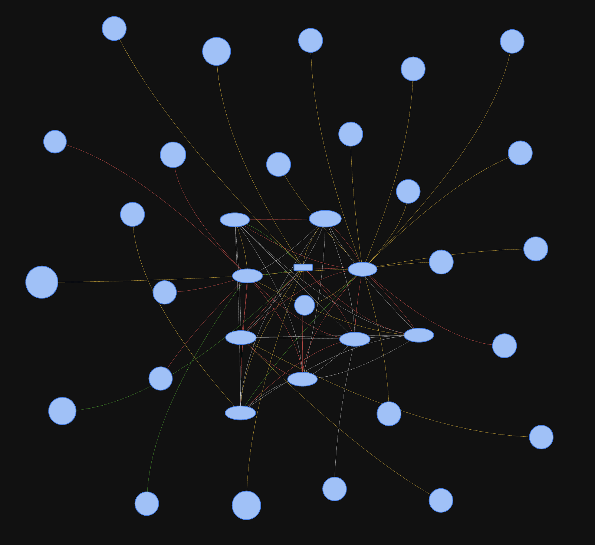

# Home Assistant Configuration

Here's my [Home Assistant](https://home-assistant.io/) configuration on [Home Assistant Yellow](https://www.home-assistant.io/yellow/).

You can check my current HA version [here](.HA_VERSION). If you like anything here, Be sure to :star2: my repo!

## Some of the devices and services that I use with HA

  * Sensors
    * [Tesla Smart](https://www.teslasmart.com/smart-sensors) (Currently using [temperature/humidity](https://www.teslasmart.com/tesla-smart-sensor-temperature-and-humidity), [door/window](https://www.teslasmart.com/tesla-smart-sensor-windows-and-door), [smoke](https://www.teslasmart.com/tesla-smart-sensor-smoke) and [motion](https://www.teslasmart.com/tesla-smart-sensor-motion) sensors from them)
    * [Tuya Zigbee smoke detectors](https://www.aliexpress.com/item/1005005863519099.html?spm=a2g0o.order_list.order_list_main.17.c00b1802nC96cB)
    * [Sonoff door/window sensor](https://www.alza.cz/EN/sonoff-snzb-04-zigbee-wireless-door-window-sensor-d6370983.htm)
    * [Aqara door/window sensors](https://www.aliexpress.com/item/1005004857635483.html?spm=a2g0o.order_list.order_list_main.11.c00b1802Bj7kmm)
  * Security
    * [Tesla Smart sensor Siren](https://www.teslasmart.com/tesla-smart-sensor-siren)
  * Networking
    * [Pi-Hole](https://pi-hole.net/) with [Sensor](https://home-assistant.io/components/sensor.pi_hole/)
  * Lights, Switches and Plugs
    * [Tesla Smart switches](https://www.teslasmart.com/tesla-smart-switch-zigbee)
    * [MOES Zigbee switches](https://www.aliexpress.com/item/1005005178438396.html?spm=a2g0o.order_list.order_list_main.5.c00b1802nC96cB) (battery powered)
    * [Zigbee LED strips](https://www.aliexpress.com/item/1005005073299542.html?spm=a2g0o.order_list.order_list_main.45.c00b1802nC96cB)
    * [SIXWGH Zigbee smart plugs](https://www.aliexpress.com/item/1005005961001716.html?spm=a2g0o.order_list.order_list_main.40.c00b1802nC96cB)
    * [Silvercrest Zigbee plug](https://www.lidl.cz/p/silvercrest-zigbee-3-0-smart-home-inteligentni-zasuvka/p100346132)
    * [Silvercrest Zigbee socket strip](https://www.lidl.cz/p/silvercrest-zigbee-3-0-smart-home-zasuvkova-lista/p100353585)
  * Media
    * [Plex](https://www.plex.tv/) for media consumption along with [Plex component](https://home-assistant.io/components/media_player.plex/)
  * Notifications:
    * [iOS ](https://home-assistant.io/docs/ecosystem/ios/notifications/basic/) for basic notifications
    * [Alexa media player](https://github.com/custom-components/alexa_media_player) for integration with Echo Dots
  * Others
    * [NFC tags](https://www.amazon.de/gp/product/B0BVFM8YVD/ref=ppx_yo_dt_b_asin_image_o04_s00?ie=UTF8&psc=1)

## My Home Assistant dashboard

Here is my screenshot (please note that it may not be the most updated image, but you should get an idea).

# Useful links

* [HA cheat sheet](https://github.com/arsaboo/homeassistant-config/blob/master/HASS%20Cheatsheet.md) for miscellaneous tips and tricks.
* The idea for this repo was taken from [arsaboo/homeassistant-config](https://github.com/arsaboo/homeassistant-config)
